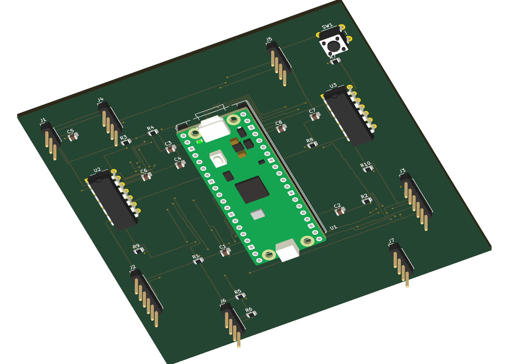

# Traction-aware warehouse rover

An entirely virtual control-engineering project: a differential-drive rover, linear PI/LQR and nonlinear tracking, traction estimation/supervision, ROS 2, a custom controller PCB, and live tests.

The plant models independent wheel/body velocity, motor current, payload and friction-limited contact. A noisy delayed pose sensor plus wheel encoders and IMU feeds the estimator. Simulator truth is used only for sensor generation and evaluation.

**· [Phase results](docs/PHASE_RESULTS.md) · [Download KiCad project](https://snow-warrior07.github.io/traction-aware-amr/downloads/traction-aware-amr-kicad.zip) · [PDF report](https://snow-warrior07.github.io/traction-aware-amr/downloads/phase-report.pdf)



The demo includes four-controller recorded playback, supervisor-off overlays, filters across 540 measured scenarios, actual PCB/schematic views, ROS and Gazebo evidence, fault/timing tables, and a narrated video with captions. It runs entirely in the browser; physical hardware is unnecessary.

Local KiCad 10.0.6 checks: **zero ERC violations, zero DRC violations, zero unconnected items, and zero schematic/PCB parity issues**. The 29-component board has 29 connected signal/power nets plus 18 single-pad no-connect nets. Source, project libraries, Gerbers, drills, netlist, renders, and board STEP are included. On the development computer the editable project is also on the Desktop in `TractionAwareAMR-KiCad/traction_carrier.kicad_pro`.

All 540 routes completed. Low-traction integrated-slip reduction was 18.76% for LQR and 18.48% for nonlinear tracking; the 20% hypothesis was not met. Four recorded soft real-time runs had zero 20 ms compute misses. Five injected faults disabled the drive. The corrected Gazebo torque/contact test passed separately from the mathematical-plant study; saved evidence is in `results/gazebo_smoke.json`.

GitHub verification tests are manual at the user's request. Prior failed runs are retained. GitHub Pages publication runs independently; no green CI badge is used as an engineering claim.

## Preview the website

```bash
python -m http.server 8080 --bind 127.0.0.1 --directory site
```

Open `http://127.0.0.1:8080/`. The website uses static HTML/CSS/JavaScript and saved JSON data; no backend or account is needed. If Windows reserves this port, use `0` instead and open the assigned port printed by Python. Package downloads/assets using `python tools/package_delivery.py` after generating the report/video. See `requirements-demo.txt` for authoring dependencies.

## Run locally

Use Python 3.12 and a 64-bit C++ compiler. Linux is the simplest reproduction environment. The Windows development host used MATLAB R2024b's installed LCC64 with the same C-compatible C++ source because its MinGW installation is 32-bit. Windows runtime math functions are bound explicitly; Linux uses standard libm.

```bash
python -m venv .venv
source .venv/bin/activate
pip install -r requirements.txt
python -m pytest -q
python -m amr.experiments smoke
python -m amr.experiments matrix --workers 4
python -m amr.experiments live --variant D --seconds 16
python -m amr.experiments faults
```

On Windows, use `.venv\Scripts\python.exe` for the Python commands. The native library is compiled from `firmware/core.cpp` on first import. Generated measurements go into `results/`.

## Phases

1. Requirements and fixed experiment criteria: `docs/requirements.md`, `config/robot.yaml`, `experiments/scenarios.yaml`.
2. Plant/contact dynamics and warehouse model: `firmware/core.cpp`, `amr/simulation.py`, `tools/generate_world.py`.
3. Actual ROS graph, service, TF and bag replay: `ros_ws/`, `tools/ros_smoke.py`, `tools/gazebo_smoke.py`.
4. Linear wheel PI and trajectory LQR: `amr/control.py`, native control core, stability and tracking tests.
5. Nonlinear controller, sensor estimator and supervisor: matched A/B/C/D comparison.
6. Pico carrier PCB, RC circuit and virtual I/O: `tools/generate_pcb.py`, `hardware/spice/`, `amr/board.py`.
7. Regression, faults, live timing and standards mapping: tests, saved results, phase report.
8. GitHub verification and public release: Actions artifacts and static demonstration.

Each phase is reported from executed evidence in `docs/PHASE_RESULTS.md`. Website playback replays recorded measurements; it does not execute ROS or KiCad in the browser.

## Controller comparison

| Variant | Outer controller | Traction supervisor |
|---|---|---|
| A | LQR | Off |
| B | LQR | On |
| C | Nonlinear | Off |
| D | Nonlinear | On |

The full matrix contains 540 runs: four variants, three traction conditions, three payloads, three routes and five noise seeds. Acceleration/braking demands exercise traction while crossing a low-friction patch. Slip reduction is measured rather than assumed, and delivery-time/error/energy tradeoffs remain visible.

## ROS and PCB verification

The workflow runs Ubuntu 24.04, ROS 2 Jazzy/Gazebo Harmonic and KiCad 9/ngspice. ROS tests execute real DDS traffic, controller commands, transforms, a service call, and rosbag record/replay. Gazebo receives wheel effort through `ros_gz_bridge` and compares dry/low-friction contact. The four-controller matrix uses the inspectable mathematical plant; Gazebo contact tests are a separate validation, not identical numerical replicas.

The PCB is a custom Raspberry Pi Pico carrier for external motor drivers. Motor power does not flow through the logic carrier. External drivers provide 0.1 V/A centered current measurements and active-low faults; the PCB filters measurements and latches drive authorization independently of ROS. Part choices, pin assignments, routing and exports are inspectable. Selected RC circuits are modeled in ngspice; the whole assembled board, EMI and embedded timing are not physically validated.

Live runs are wall-clock-paced soft real-time tests on ordinary operating systems. Reports include compute deadline misses and wake-up lateness separately. They do not demonstrate hard real-time scheduling or safety certification.

See `docs/control-derivation.md`, `docs/standards.md`, and the measured `results/` files for model assumptions and scope.

